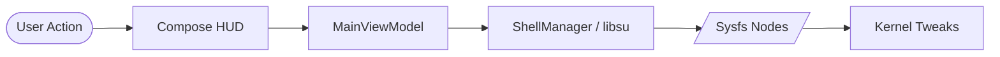

# DFG Controller (DaisyForGaming Controller)

[](https://github.com/bmjubairdadu/DFG-Controller/actions/workflows/android.yml)
[](https://github.com/bmjubairdadu/DFG-Controller/releases)
[](https://opensource.org/licenses/MIT)

DFG Controller is an advanced, gaming-focused Android application for rooted devices. It provides a highly polished, HUD-style interface for fine-tuning your kernel parameters, optimizing network stability, and managing hardware-level charging behavior.

## Overview
Built with Jetpack Compose and Material 3, DFG Controller solves the problem of "flat" and generic system tuning apps. It is intended for gamers and power users who want maximum control over their device's hardware without compromising on visual aesthetics or security.

## Features

### 🚀 Performance & Smoothness
- **Dashboard HUD**: Real-time tracking of kernel version, CPU governor, and I/O scheduler.
- **Smoothness Controls**: Animated toggles for **Touch Boost** (with duration slider) and **Smart Memory Management** (Aggressive LMK).
- **Gaming Mode**: A master switch that instantly applies aggressive background app killing and performance presets.
- **Games Manager**: Per-app triggers to automatically enable performance tweaks when your favorite games launch.

### 🔋 Battery & Power
- **Bypass Charging**: Run your device directly on external power while gaming, significantly reducing battery heat and throttling.
- **Fast Charge Priority**: Force the kernel to prioritize charging speed within safe hardware limits.
- **Wakelock Inspector**: Live diagnostic tool to identify apps preventing your device from sleeping.

### 📺 Display & UI
- **KCAL Calibration**: Full RGB control over your panel's color output with live previews.
- **Resolution & DPI**: Quickly scale between 720p and 1080p, and adjust screen density (DPI) via a responsive slider/input.

### 🧠 Memory & System
- **zRAM Control**: Managed compressed swap space with live usage visualization and manual compaction support.
- **TCP Congestion**: Selection of advanced networking algorithms (Cubic vs. BBR) for lower latency in multiplayer games.
- **Package Viewer**: Deep-dive into all system and user packages, including target SDK and UID info.

## Quick Links
- [🚀 Features Details](docs/FEATURES.md)
- [🏗️ Application Architecture](docs/ARCHITECTURE.md)
- [📥 Installation Guide](docs/INSTALLATION.md)
- [📖 User Guide](docs/USER_GUIDE.md)
- [🔄 Update System](docs/UPDATE_SYSTEM.md)

## How It Works
DFG Controller acts as a user-friendly bridge between the Android UI and the Linux Kernel's `sysfs` interface.



## Requirements
- **OS**: Android 8.0+ (Oreo)
- **Root**: Required (Magisk, KernelSU, or APatch)
- **Kernel**: Supporting KCAL, Bypass Charging, and zRAM sysfs nodes.

## Installation
1. Download **`DFG Controller.apk`** from [Official Releases](https://github.com/bmjubairdadu/DFG-Controller/releases).
2. Install the APK (Allow "Unknown Sources" if prompted).
3. Grant **Root Access** and **Usage Access** on first launch.

## Development
```bash
git clone https://github.com/bmjubairdadu/DFG-Controller.git
./gradlew assembleDebug
```
For more details, see the [Development Guide](docs/DEVELOPMENT.md).

---
© 2026 DaisyForGaming Kernel Team. Distributed under the MIT License.
