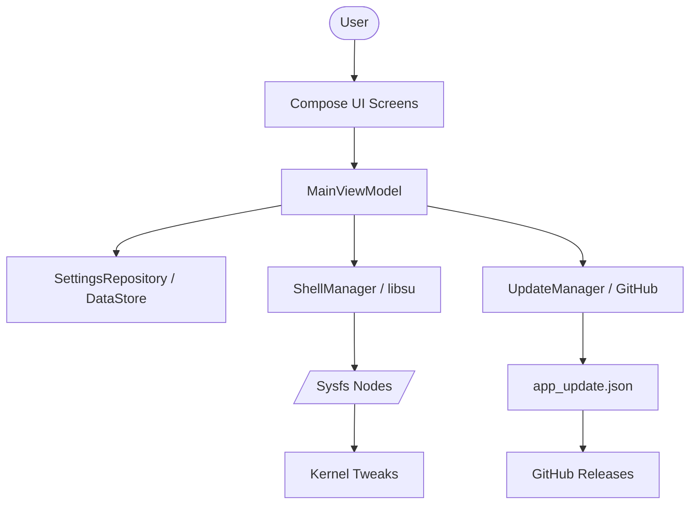

# Application Architecture

DFG Controller follows a modern Android architecture using Jetpack Compose, ViewModels, and a custom repository layer for handling sysfs interactions and persistence.

## Overview Diagram

## Core Components

### 1. Presentation Layer (UI)
- **Compose UI**: Declarative UI components built with Material 3.
- **ViewModels**: `MainViewModel` manages the UI state and coordinates data flow between services and the UI.
- **Screens**: Modularized screens (Dashboard, Power, Games, etc.) under `com.daisyforgaming.ui.screens`.

### 2. Logic Layer (Core)
- **ShellManager**: A secure wrapper around `libsu` for executing root commands and handling sysfs I/O.
- **UpdateManager**: Manages the version check, download, and integrity verification (SHA-256) of new APKs.
- **SecurityUtils**: Implements anti-tampering measures like signature hash checking and debugger blocking.
- **StringObfuscator**: Handles runtime decryption of sensitive sysfs paths to prevent reverse engineering.

### 3. Data Layer
- **SettingsRepository**: Uses **Jetpack DataStore (Preferences)** to persist user selections (governors, game lists, themes).
- **SettingsApplier**: A utility that translates stored preferences into actual kernel writes on app launch or boot.

### 4. Background Services
- **GameModeService**: Monitors foreground app usage to trigger performance profiles when a selected game starts.
- **BypassChargingService**: Monitors battery status and foreground apps to enable thermal-friendly bypass charging.
- **BootReceiver**: Triggers `SettingsApplier` immediately after `ACTION_BOOT_COMPLETED`.

## Data Flow
1. **User Action**: User toggles a setting (e.g., Gaming Mode).
2. **ViewModel**: Updates its internal state and calls `SettingsRepository` to save the choice.
3. **Repository**: Commits the change to DataStore.
4. **Shell Execution**: The ViewModel (or `SettingsApplier`) uses `ShellManager` to write the corresponding value to the kernel sysfs node.
5. **Real-time Feedback**: The UI reflects the change with an animated pulse or checkmark.
