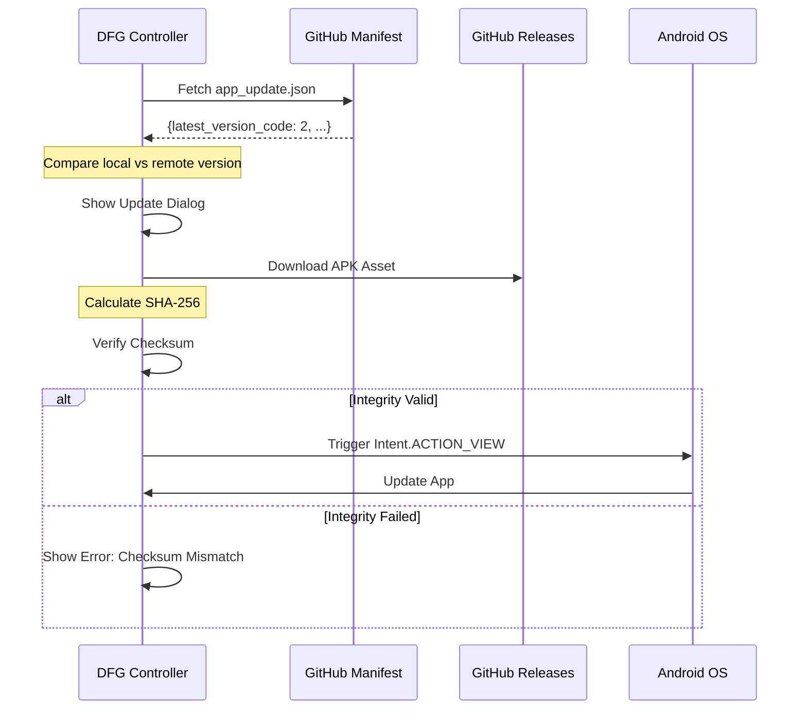

# Update System Documentation

DFG Controller features a robust, self-hosted update mechanism that bypasses the need for the Play Store.

## Update Flow

## Infrastructure

### 1. The Manifest
The source of truth for updates is [app_update.json](https://raw.githubusercontent.com/bmjubairdadu/DFG-Controller/main/app_update.json). It contains:
- `latest_version_code`: Incremental number used for comparison.
- `latest_version_name`: Semantic version (e.g., 1.0.1).
- `download_url`: Direct link to the APK in GitHub Releases.
- `sha256`: Hex-encoded hash of the APK for security.
- `mandatory`: If true, the update dialog cannot be dismissed.

### 2. Checksum Verification
To prevent "Man-in-the-middle" attacks or corrupted downloads, the app calculates the SHA-256 hash of the downloaded file locally and compares it byte-for-byte with the hash provided in the manifest.

### 3. Installation API
The app uses `androidx.core.content.FileProvider` to safely share the downloaded APK with the system's package installer.

## Release Process for Developers
To push an update:
1. Update version in `build.gradle.kts`.
2. Run `./scripts/release_app.sh`.
3. The script builds the APK, publishes the GitHub Release, calculates the hash, and pushes the updated `app_update.json` to the repo automatically.
